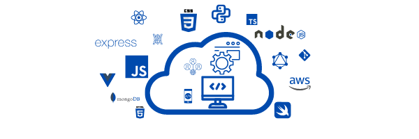

<h1
id="headerText"
style="
border: solid navy 5px;
color: white;
background-color: navy;
border-radius: 5px;
padding: 0px;
"
>
Full Stack Developer | DevOps Engineer
</h1>

<h2>
Hello 👋🏽 Welcome to My GitHub! Want to see what I've been working on? -- Check out my pinned projects below 👇🏽
</h2>